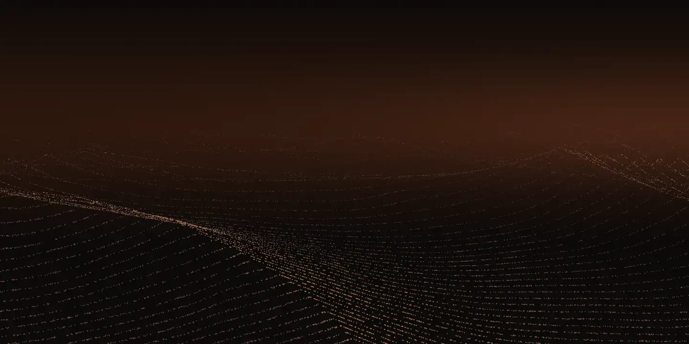

# Sahra

[](https://github.com/MostafaSaafan5517/sahra/actions/workflows/ci.yml)

Sahra (Arabic for "desert") is a generative scene of wind moving over desert sand. Tens of thousands of grains form dune lines that drift on their own, your cursor or finger is a gust that scatters them, and the light moves slowly between dawn, midday and dusk. It is the homepage of a fictional design studio, built as a creative front-end portfolio project by Mostafa Saafan, to production standards for performance and accessibility.



- **Live:** [sahra-khaki.vercel.app](https://sahra-khaki.vercel.app)
- **The Lab:** [a pattern that draws itself, and a scroll story](https://sahra-khaki.vercel.app/lab/)
- **The scene on any page:** [embed demo](https://sahra-khaki.vercel.app/embed/) and [how to embed it](docs/embedding.md)
- **How it works:** [the technical write-up](docs/how-it-works.md) and [the measurements](docs/performance.md)

Mostafa Saafan built it and is available for work: [Hire on Upwork](https://www.upwork.com/freelancers/~0104fa36ecdc4bf8a1).

## What is in it

- **The scene** (home page). Up to 49,152 grains drawn as points, with all motion in a custom GLSL vertex shader: drift, a noise flow field, ridged dunes that creep downwind, sun shading, haze. Gusts from the mouse or a finger push, scatter and lift the sand, which then settles. The light cycles through the day in three minutes.
- **The Lab.** Two studies of the kind clients ask for. An eight-point star pattern in the tradition of Islamic geometric art, computed with Hankin's method at build time and drawn in plain SVG and CSS. And a scroll story with GSAP ScrollTrigger: a pinned section with staged reveals, then a pinned horizontal pan through stills of the scene at dawn, midday and dusk.
- **The embed.** One script and a `div` put the scene on any site (Webflow, WordPress, Framer, plain HTML), with options for the light, five colours and the density of grains. A 3 kB loader starts each box as it nears the screen and loads the scene only where it can run.

```html
<div data-sahra style="height: 480px; background: #0b0908"></div>
<script type="module" src="https://sahra-khaki.vercel.app/embed/sahra.js"></script>
```

## How it stays fast

- **60 frames a second on real hardware:** 60.1 fps on a mid-range Android phone (HONOR 400, Adreno 720) at the full 49,152 grains, 58.8 fps while dragging a finger through the sand, and 60 fps on a 2015 laptop's integrated GPU.
- **Lighthouse on mobile, in CI, on every pull request:** median Performance 100 on all three pages, 100 for Accessibility, Best Practices and SEO, and no layout shift. CI fails below 90 and 95.
- **Text first, scene after.** The HTML carries the text and a poster of the scene's first frame. Three.js downloads only after the page has loaded and the browser is idle, and only where WebGL2 runs on a GPU. Without one, the poster stays.
- **All motion on the GPU.** Per frame, JavaScript sets a few uniforms and draws two objects. No per-grain work on the CPU.
- **Quality that fits the device.** Four tiers of grains and pixel ratio. The starting tier comes from the device, and a frame-rate monitor steps down when frames run late, or gives way to the poster when even the lightest tier is too slow.
- **Rest when unseen.** Nothing renders while the tab is hidden or the scene is off screen, and stopping releases the GPU's memory at once.
- **Weight budgets in CI** for every file a visitor downloads.

The [write-up](docs/how-it-works.md) explains each technique; [performance.md](docs/performance.md) has every measurement, including the ones that did not go well at first.

## Accessibility

- Text keeps WCAG AA contrast over every lighting state, measured from screenshots by a test across the day, not judged by eye.
- Every page passes axe checks (WCAG 2.2 AA plus best practices) in both a desktop and a phone profile.
- Keyboard navigation with a visible focus ring throughout; the scene is decorative and hidden from screen readers.
- With reduced motion: a still frame of the scene, the finished pattern, and the scroll story as a plain page.

## Built with

Vite 8 and TypeScript (strict), Three.js with custom GLSL shaders, GSAP with ScrollTrigger (the Lab's scroll story only), Tailwind CSS v4, Vitest, Playwright with axe, Lighthouse CI, GitHub Actions, and Vercel.

## Running it

Requires Node 24 and pnpm 11.

```bash
pnpm install
pnpm dev                    # the site on http://localhost:3300
pnpm build && pnpm preview  # the production build on http://localhost:3301 (the embed demo at /embed/)
```

Useful flags on the home page: `?debug` shows the frame rate and quality tier, `?tune` opens a panel of sliders for the wind, the dunes and the light, and `?quality=high|medium|low|minimal` fixes the quality tier.

## Testing

```bash
pnpm test                      # unit tests (Vitest)
pnpm test:e2e                  # end-to-end tests (Playwright, desktop and phone) on the production build
pnpm build && pnpm lighthouse  # Lighthouse CI, mobile, five runs per page
pnpm size                      # size budgets for the built files
```

GitHub Actions runs all of them on every pull request and every push to `main`: formatting, lint, type checks and unit tests; end-to-end tests, including accessibility, readability over the scene, layout stability and the embed running on a page from another origin; and Lighthouse with its budgets.

## Credits

- [Instrument Sans](https://github.com/Instrument/instrument-sans), under the SIL Open Font License (`src/fonts/OFL.txt`).
- Simplex noise from [webgl-noise](https://github.com/stegu/webgl-noise) by Ian McEwan and Stefan Gustavson (Ashima Arts), MIT.
- [Three.js](https://threejs.org) (MIT) and [GSAP](https://gsap.com) (GSAP's standard no-charge licence).
- The star pattern follows E. H. Hankin's "polygons in contact" method, as described by Craig S. Kaplan in "Islamic Star Patterns from Polygons in Contact" (Graphics Interface, 2005).

Sahra is a fictional studio, so the site names no clients and shows no testimonials or awards.
